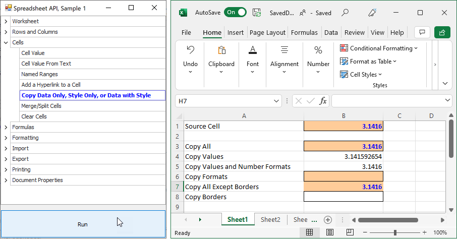

<!-- default badges list -->

<!-- default badges end -->
# Spreadsheet Document API – How to Process Excel Workbooks in Code (Part 1)

The [DevExpress Spreadsheet Document API](https://docs.devexpress.com/OfficeFileAPI/14912/spreadsheet-document-api) is a non-visual library that allows you to generate, import, export, modify, and print Microsoft Excel workbooks in code. 

> You need a license for the [DevExpress Office File API Subscription](https://www.devexpress.com/products/net/office-file-api/) or [DevExpress Universal Subscription](https://www.devexpress.com/subscriptions/universal.xml) to use this library in production code. 

This example demonstrates how to use the Spreadsheet Document API to execute the following actions: 

- Manage spreadsheet document elements (worksheets, cells, rows, and columns)
- Create formulas  
- Format cells 
- Import data from different data sources 
- Export a workbook to PDF 
- Print a workbook 
- Specify the built-in and custom document properties 

The application form contains the list of supported operations. A user can select an operation and click the **Run** button to view the resulting spreadsheet document in Microsoft Excel.

<!-- default file list -->
## Files to Look At

- [CellActions.cs](./CS/SpreadsheetExamples/SpreadsheetActions/CellActions.cs) (VB: [CellActions.vb](./VB/SpreadsheetExamples/SpreadsheetActions/CellActions.vb)) 
- [DocumentPropertiesActions.cs](./CS/SpreadsheetExamples/SpreadsheetActions/DocumentPropertiesActions.cs) (VB: [DocumentPropertiesActions.vb](./VB/SpreadsheetExamples/SpreadsheetActions/DocumentPropertiesActions.vb)) 
- [ExportActions.cs](./CS/SpreadsheetExamples/SpreadsheetActions/ExportActions.cs) (VB: [ExportActions.vb](./VB/SpreadsheetExamples/SpreadsheetActions/ExportActions.vb)) 
- [FormattingActions.cs](./CS/SpreadsheetExamples/SpreadsheetActions/FormattingActions.cs) (VB: [FormattingActions.vb](./VB/SpreadsheetExamples/SpreadsheetActions/FormattingActions.vb)) 
- [FormulaActions.cs](./CS/SpreadsheetExamples/SpreadsheetActions/FormulaActions.cs) (VB: [FormulaActions.vb](./VB/SpreadsheetExamples/SpreadsheetActions/FormulaActions.vb)) 
- [ImportActions.cs](./CS/SpreadsheetExamples/SpreadsheetActions/ImportActions.cs) (VB: [ImportActions.vb](./VB/SpreadsheetExamples/SpreadsheetActions/ImportActions.vb)) 
- [PrintingActions.cs](./CS/SpreadsheetExamples/SpreadsheetActions/PrintingActions.cs) (VB: [PrintingActions.vb](./VB/SpreadsheetExamples/SpreadsheetActions/PrintingActions.vb)) 
- [RowAndColumnActions.cs](./CS/SpreadsheetExamples/SpreadsheetActions/RowAndColumnActions.cs) (VB: [RowAndColumnActions.vb](./VB/SpreadsheetExamples/SpreadsheetActions/RowAndColumnActions.vb)) 
- [WorksheetActions.cs](./CS/SpreadsheetExamples/SpreadsheetActions/WorksheetActions.cs) (VB: [WorksheetActions.vb](./VB/SpreadsheetExamples/SpreadsheetActions/WorksheetActions.vb)) 

<!-- default file list end -->

## Documentation

- [Worksheets](https://docs.devexpress.com/OfficeFileAPI/14930/spreadsheet-document-api/examples/worksheets)
- [Rows and Columns](https://docs.devexpress.com/OfficeFileAPI/14938/spreadsheet-document-api/examples/rows-and-columns)
- [Cells](https://docs.devexpress.com/OfficeFileAPI/14944/spreadsheet-document-api/examples/cells)  
- [Formulas](https://docs.devexpress.com/OfficeFileAPI/14928/spreadsheet-document-api/spreadsheet-formulas)
- [Cell Formatting](https://docs.devexpress.com/OfficeFileAPI/14915/spreadsheet-document-api/cell-basics/formatting-cells) 
- [Import and Export Data](https://docs.devexpress.com/OfficeFileAPI/118182/spreadsheet-document-api/examples/import-and-export-data)  
- [Printing](https://docs.devexpress.com/OfficeFileAPI/15532/spreadsheet-document-api/examples/printing)  
- [Specify Document Properties](https://docs.devexpress.com/OfficeFileAPI/117097/spreadsheet-document-api/examples/workbooks/how-to-specify-document-properties) 

## More Examples

- [Spreadsheet Document API - Part 2](https://github.com/DevExpress-Examples/spreadsheet-document-api-examples-part-2-t217615)
- [Spreadsheet Document API - Part 3](https://github.com/DevExpress-Examples/spreadsheet-document-api-part-3)
<!-- feedback -->
## Does this example address your development requirements/objectives?

 

(you will be redirected to DevExpress.com to submit your response)
<!-- feedback end -->
